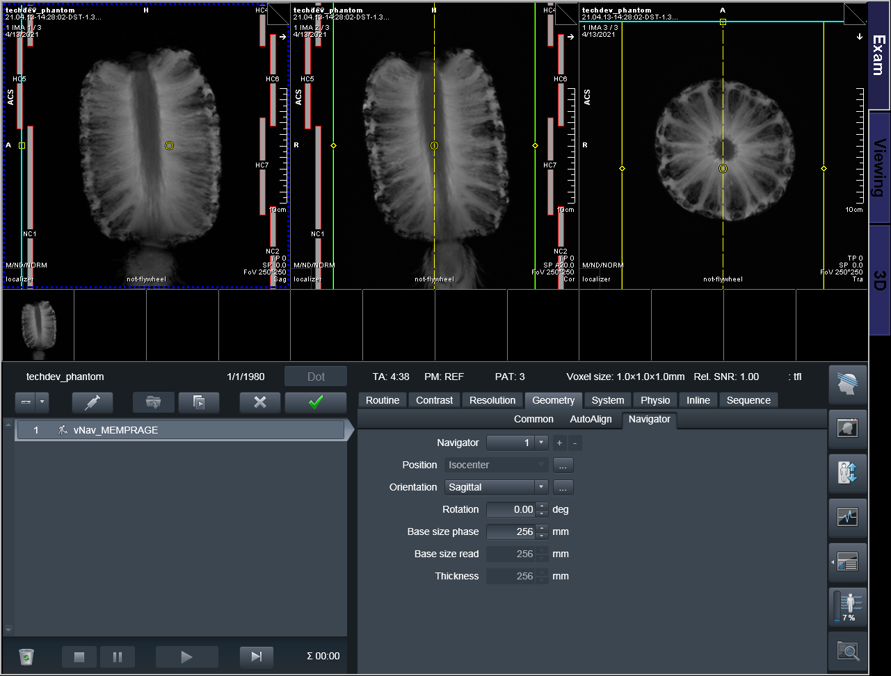
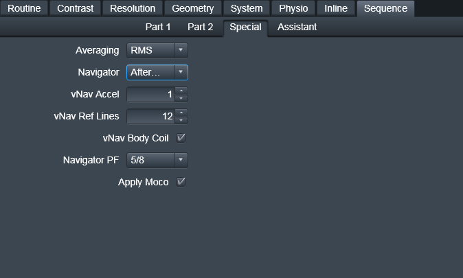

## Setting the navigator parameters
Unlike previous versions of the vNav sequences, the navigator and "parent" (*e.g.*, MPRAGE) sequence are contained in a single protocol; there is no setter anymore. The UI shows both the "parent" FOV in yellow, and the navigator FOV in cyan. The navigator's details can be further modified on the `Geometry>Navigator` card. For right now, we ask that you don't modify these parameters, as not all variations are fully supported. If your application needs changes to these parameters, please contact Dylan Tisdall (mtisdall@pennmedicine.upenn.edu) to ensure your changes are feasible.

## Settings on the `Special` card

### Averaging (only in vNavMEMPRAGE)
Selects how the multiple echoes are combined.

Options:

* None - perform no averaging; one series with all echoes is saved
* RMS - perform RMS averaging; two series are saved, first with all echoes, and second with the RMS average
* RMS Only - perform RMS averaging; one series is saved with the RMS average

### Navigator 
Selects where the navigator is inserted in the TR. Note that options may not be visible if there is not sufficient time in the current protocol for a navigator to be inserted. For example, if the TI is too short, then th navigator cannot be inserted "Before Readout".

*In vNavT2SPACE curently only "After Readout" is supported*

Options:

* No Navigator - no navigator is inserted; sequence behaves as a multi-echo MPRAGE 
* Before Readout - navigator is inserted between the inversion pulse an readout train 
* After Readout - navigator is inserted after readout train and before subsequent inversion pulse 

### vNav Accel and vNav Ref Lines 
These are not yet fully supported, so please do not modify these parameters.

### vNav Body Coil
Selects whether the vNav is acquired using the body coil or the coil elements selected for the "parent" (*e.g.*, MPRAGE).

### Navigator PF 
Selects the partion-direction partial Fourier sampling of the navigator.

### Apply Moco
Selects whether motion correction is applied to the "parent" sequence. Leaving this unchecked will still passively track motion, which will be stored in the vNav DICOM series.
